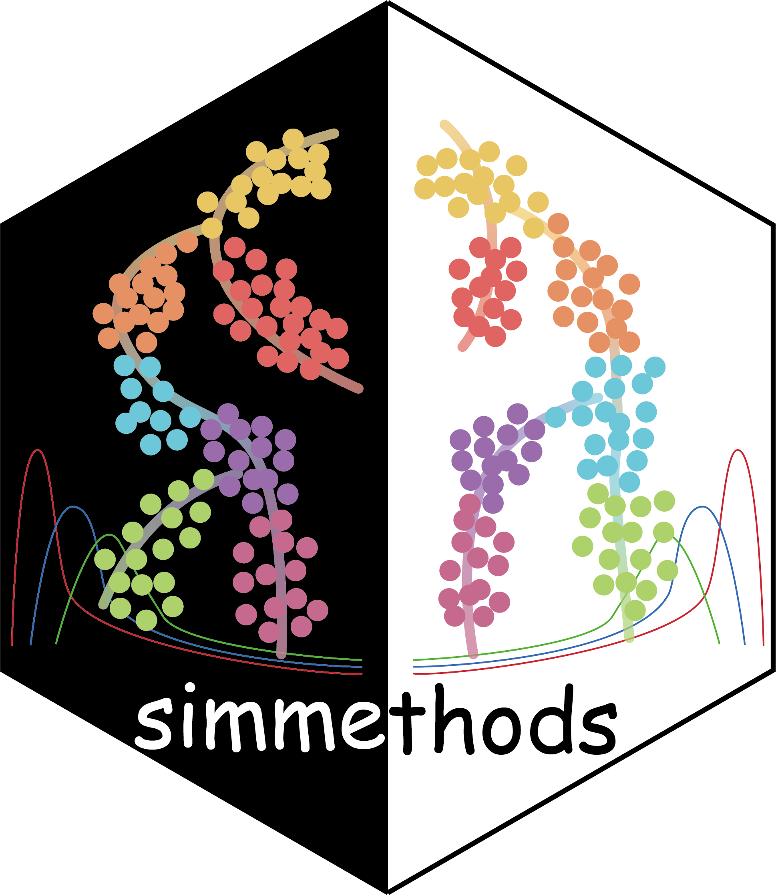

# A collection of 42 simulation methods for single-cell RNA-seq data

Simmethods collects and documents 36 popular and common simulation
methods for single-cell transcriptomics data. To satisfy user’s
requirements in different scenarios, we bundled the simulators
comprehensively and users can simulate many kinds of single-cell RNA-seq
data (different number of groups, batches, differential expressed genes
and even data with differentiation trajectory) using certain methods. If
you want to learn how to use a certain simulation method, please check
the following chart and commit an issue or send an Email to us when you
have any question.

## The list of simulation methods

| method         | language                                                           | url                                                                                                                                                    | doi                                                                                                                              | journal                    |
|:---------------|:-------------------------------------------------------------------|:-------------------------------------------------------------------------------------------------------------------------------------------------------|:---------------------------------------------------------------------------------------------------------------------------------|:---------------------------|
| BASiCS         |       |              |      | PLoS Computational Biology |
| BEARscc        |       |         |        | Nature Communications      |
| CancerInSilico |       |  |      | PLoS Computational Biology |
| dropsim        |       |                                       |                                                                                                                                  | NA                         |
| dyngen         |       |                    |        | Nature Communications      |
| dyntoy         |       |                                           |                                                                                                                                  | NA                         |
| ESCO           |       |                                              |    | Bioinformatics             |
| hierarchicell  |       |                                      |        | BMC Genomics               |
| Kersplat       |       |            |         | Genome Biology             |
| Lun            |       |            |         | Genome Biology             |
| Lun2           |       |            |         | Genome Biology             |
| MFA            |       |                                       |  | Wellcome Open Research     |
| muscat         |       |                                           |        | Nature Communications      |
| phenopath      |       |           |                    | bioRxiv                    |
| POWSC          |       |            |    | Bioinformatics             |
| powsimR        |       |                                            |     | Bioinformatics             |
| PROSSTT        |  |                                |     | Bioinformatics             |
| scDD           |       |            |         | Genome Biology             |
| scDesign       |       |                                      |     | Bioinformatics             |
| scDesign2      |       |                                        |        | Genome Biology             |
| SCRIP          |       |                     |                                                                                                                                  | NA                         |
| Simple         |       |            |         | Genome Biology             |
| SparseDC       |       |                    |               | Nucleic Acids Research     |
| SPARSim        |       |                                         |     | Bioinformatics             |
| Splat          |       |            |         | Genome Biology             |
| SplatPop       |       |            |        | Genome Biology             |
| SPsimSeq       |       |        |    | Bioinformatics             |
| SymSim         |       |                                           |        | Nature Communications      |
| TedSim         |       |                                           |               | Nucleic Acids Research     |
| VeloSim        |       |                                          |         | bioRxiv                    |
| zinbwave       |       |         |        | Nature Communications      |
| zinbwaveZinger |       |                                  |         | Genome Biology             |
| zingeR         |       |                                          |         | Genome Biology             |

## New methods

We are glad to add new simulation methods if some methods are innovative
and creative that many users commonly used. If you have the
requirements, please tell me by email (<duohongrui@cqnu.edu.cn>) or
raise an issue for that.
